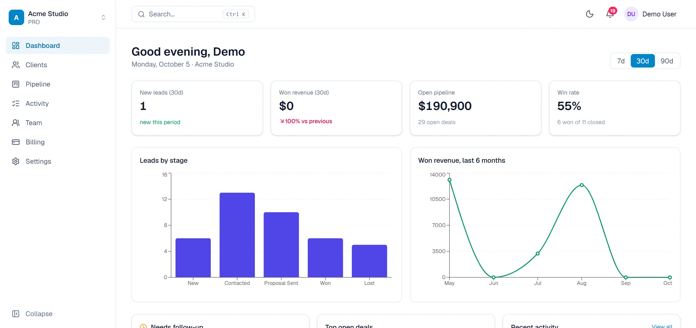
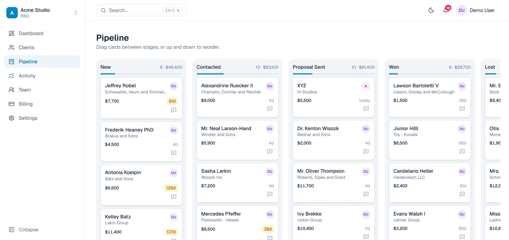
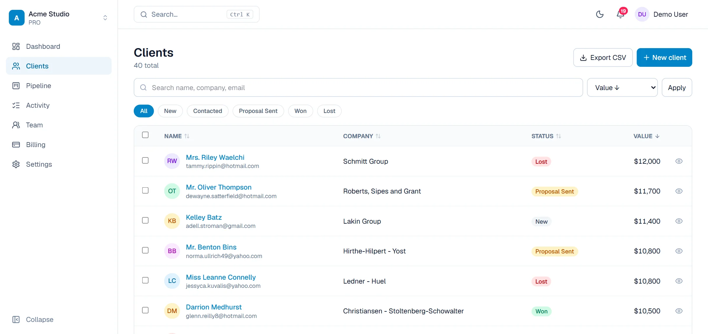

# PulseCRM

**A multi-tenant CRM built as a complete, production-style SaaS demo.**
Teams track leads, run a visual sales pipeline, log every conversation and see revenue at a glance, each inside their own private, secure workspace.

<picture>
  <source media="(prefers-color-scheme: dark)" srcset="public/screens/dashboard-dark.webp">
  
</picture>

> **Purpose of this project:** PulseCRM is a portfolio and sales demo. It shows what a real SaaS product looks like end to end: authentication, teams and roles, subscription billing, data isolation, a polished UI and a marketing site. All data in the demo is sample data. No real customers or payments are involved (billing runs in Stripe test mode).

---

## Contents

- [What it does](#what-it-does)
- [Screenshots](#screenshots)
- [Feature tour](#feature-tour)
- [Roles and permissions](#roles-and-permissions)
- [Plans and billing](#plans-and-billing)
- [Security and data privacy](#security-and-data-privacy)
- [Tech stack](#tech-stack)
- [Architecture](#architecture)
- [Getting started](#getting-started)
- [Environment variables](#environment-variables)
- [Scripts](#scripts)
- [Project structure](#project-structure)
- [Data model](#data-model)
- [Deployment](#deployment)
- [Known limitations and roadmap](#known-limitations-and-roadmap)
- [FAQ](#faq)

---

## What it does

PulseCRM is a lightweight customer relationship manager for freelancers, agencies and small sales teams.

| You can | How |
|---|---|
| Keep every lead and client in one place | Searchable, filterable, sortable client list with bulk actions |
| See where every deal stands | Drag-and-drop pipeline across five stages |
| Remember every conversation | Per-client activity timeline: calls, emails, meetings and notes |
| Know what to do next | Dashboard with trends, follow-up reminders and top deals |
| Work as a team | Workspaces, invitations and owner / admin / member roles |
| Grow without limits | Free plan and Pro plan with Stripe checkout |

## Screenshots

| Pipeline | Clients |
|---|---|
| <picture><source media="(prefers-color-scheme: dark)" srcset="public/screens/pipeline-dark.webp"></picture> | <picture><source media="(prefers-color-scheme: dark)" srcset="public/screens/clients-dark.webp"></picture> |

Every screen supports **light and dark mode** and adapts to a **per-workspace accent colour**.

---

## Feature tour

### Marketing site
- Sticky navigation that highlights the section you are reading, with a mobile menu
- Hero, features, how it works, interactive product tour, use cases, pricing, FAQ and call to action
- Subtle scroll animations that respect the "reduce motion" setting
- Aware of your sign-in state: signed-in visitors see "Open dashboard" instead of "Start free"

### Accounts and workspaces
- Email and password sign-up and sign-in
- Every new account gets its own workspace automatically
- **Invitations by link** with a safe return flow: open the link, sign up or sign in, land back on the invite and accept
- **Workspace switcher** for people who belong to more than one workspace
- Clear "you're already signed in" handling instead of confusing redirects
- Friendly handling of expired sessions

### Clients
- Add, edit and delete clients with name, company, email, phone, deal value and stage
- Search by name, company or email, filter by stage, sort by any column
- **Bulk actions:** select many clients to change their stage or delete them
- **Undo delete:** deleted clients disappear instantly and can be restored for six seconds
- **CSV export** of whatever list you are currently viewing
- **Quick view** side panel to peek at a client and recent activity without leaving the list
- Detail page with contact links, summary cards, stage selector and full activity timeline
- Pagination and a sticky table header

### Pipeline
- Five stages: New, Contacted, Proposal Sent, Won, Lost
- Smooth **drag-and-drop** between stages, plus reordering inside a stage; the order is saved
- Each card shows the owner's avatar and how long it has sat in its stage, with an amber warning after 14 days
- Column totals and a share-of-pipeline bar
- **Log an activity** straight from a card

### Dashboard
- Greeting and a 7 / 30 / 90 day range filter
- Four headline numbers: new leads, won revenue, open pipeline, win rate, with change versus the previous period
- Leads-by-stage and 6-month revenue charts with proper empty states
- **Needs follow-up:** open deals with no contact in 14+ days
- Top open deals and a recent activity feed
- **Onboarding checklist** that guides new workspaces through the first steps

### Team
- Member list with avatars, emails and role badges
- Owners can change roles; owners and admins can remove members (with a confirmation dialog)
- Invite by email address, choose the role, then **copy the link** or open a prefilled email
- Pending invites with revoke

### Power-user touches
- **Command palette** (`Ctrl` + `K`): search clients and jump to any page
- **Keyboard shortcuts:** press `?` for the list; `G` then `D`, `C`, `P`, `A`, `T`, `B` or `S` jumps between pages
- Notification bell showing how many clients need a follow-up
- Collapsible sidebar and a mobile drawer
- Skeleton loading screens on every page
- Settings for your profile, workspace name and accent colour

---

## Roles and permissions

Permissions are enforced by the database itself, not just hidden in the interface.

| Action | Member | Admin | Owner |
|---|:-:|:-:|:-:|
| View clients, pipeline, dashboard, activity | Yes | Yes | Yes |
| Add and edit clients, move deals, log activity | Yes | Yes | Yes |
| Delete clients | No | Yes | Yes |
| Invite and revoke invitations | No | Yes | Yes |
| Remove members (except owners) | No | Yes | Yes |
| Change member roles | No | No | Yes |
| Change workspace name and accent colour | No | Yes | Yes |
| Manage billing and subscription | No | No | Yes |

## Plans and billing

| | Free | Pro |
|---|---|---|
| Price | $0 | $12 / month per workspace |
| Clients | Up to 25 | Unlimited |
| Pipeline, dashboard, activity, team, CSV export | Included | Included |

- Upgrades use **Stripe Checkout**; existing subscribers manage their plan in the **Stripe customer portal**.
- A **webhook** switches the workspace between Free and Pro automatically when a subscription starts, changes or ends.
- The 25-client limit is enforced by a **database trigger**, so it cannot be bypassed from the browser.
- Everything runs in **Stripe test mode**. Use card `4242 4242 4242 4242` with any future date and any CVC.

---

## Security and data privacy

PulseCRM is designed so that one team can never see another team's data.

- **Row-level security (RLS)** on every table. Each query is restricted to workspaces the signed-in user belongs to, by the database, regardless of what the app asks for.
- **Server-side validation** of all input with [Zod](https://zod.dev) before it reaches the database.
- **Role checks in the database**, for example only owners and admins can delete clients or send invitations.
- **No secrets in the browser.** The Supabase service-role key and Stripe secret key are used only in server code.
- **Safe redirects:** post-login destinations are restricted to same-site paths, preventing open-redirect attacks.
- **Spreadsheet-safe exports:** CSV cells starting with `=`, `+`, `-` or `@` are neutralised to prevent formula injection.
- **Search input is sanitised** before it is used in a database filter.
- **Signed webhooks:** Stripe events are verified with the signing secret before anything changes.
- Passwords are handled by Supabase Auth and never stored by the app.

---

## Tech stack

| Layer | Technology |
|---|---|
| Framework | [Next.js 16](https://nextjs.org) (App Router, Server Components, Server Actions) and React 19 |
| Language | TypeScript |
| Styling | Tailwind CSS 4, with a single accent colour driving every shade |
| Database and auth | [Supabase](https://supabase.com) (PostgreSQL, Row Level Security, Auth) |
| Payments | [Stripe](https://stripe.com) Checkout, customer portal and webhooks (test mode) |
| Drag and drop | dnd-kit |
| Charts | Recharts |
| Validation | Zod |
| Icons and toasts | lucide-react, Sonner |
| Tooling | ESLint, Puppeteer (used only to capture screenshots) |

## Architecture

```
Browser ──► Next.js (Vercel)
              │  proxy.ts          refreshes the session, protects private routes
              │  Server Components read data with the signed-in user's token
              │  Server Actions    validate with Zod, then write
              │  API routes        CSV export, Stripe webhook
              ▼
         Supabase
              ├─ Auth              users and sessions
              └─ PostgreSQL        tables + RLS policies + triggers
         Stripe  ◄──── webhook ───► sets workspace plan (service role, server only)
```

Key ideas:

- **Reads and writes run as the user.** The app talks to Supabase with the signed-in user's session, so RLS applies to every request.
- **The service-role key is rare and server-only.** It is used for seeding, creating Stripe customers and the webhook, never for ordinary reads.
- **Everything is workspace-scoped.** Each row carries a `workspace_id`; the active workspace is validated against the user's memberships on every request.
- **Business rules live in the database** where it matters: plan limits, "who can delete", and "who can invite" are enforced by triggers and policies.

---

## Getting started

### Prerequisites
- Node.js 20 or newer
- A free [Supabase](https://supabase.com) project
- Optional: a [Stripe](https://stripe.com) account in test mode, and the Stripe CLI for local webhooks

### 1. Install
```bash
git clone https://github.com/abhiwebdev90/Pulse-CRM.git
cd Pulse-CRM
npm install
```

### 2. Create the database
1. In Supabase, open **SQL Editor** and run [`supabase/schema.sql`](supabase/schema.sql). This creates the tables, security policies and triggers.
2. In **Authentication → Providers → Email**, turn **off** "Confirm email" so demo sign-ups can sign in straight away.

> Upgrading a database created from an earlier version? Run the files in [`supabase/migrations/`](supabase/migrations) in order instead:
> `001_client_position.sql` (saved card order) then `002_profile_email_accent.sql` (profile email and accent colour).

### 3. Configure
Copy `.env.example` to `.env.local` and fill it in. See [Environment variables](#environment-variables).

### 4. Seed the demo and run
```bash
npm run seed   # creates the demo account with 40 sample clients and activity
npm run dev    # http://localhost:3000
```

Open <http://localhost:3000> and click **Try the live demo**, then **Try the demo** on the sign-in page to fill in the demo login.

### 5. Stripe (optional)
1. In Stripe test mode, create a product with a recurring monthly price and copy its price ID.
2. Set `STRIPE_SECRET_KEY` and `STRIPE_PRO_PRICE_ID`.
3. Forward webhooks locally and copy the signing secret it prints into `STRIPE_WEBHOOK_SECRET`:
   ```bash
   stripe listen --forward-to localhost:3000/api/stripe/webhook
   ```
4. Upgrade from the **Billing** page with card `4242 4242 4242 4242`.

Without Stripe keys the app works normally; the upgrade button is simply hidden.

---

## Environment variables

| Variable | Required | Where it is used |
|---|:-:|---|
| `NEXT_PUBLIC_SUPABASE_URL` | Yes | Browser and server |
| `NEXT_PUBLIC_SUPABASE_ANON_KEY` | Yes | Browser and server (public by design; RLS protects data) |
| `SUPABASE_SERVICE_ROLE_KEY` | Yes | **Server only.** Seeding, Stripe actions and webhook. Never expose it. |
| `NEXT_PUBLIC_APP_URL` | Yes | Invite links and Stripe return URLs (`http://localhost:3000` locally) |
| `DEMO_EMAIL`, `DEMO_PASSWORD` | Yes | Demo account created by `npm run seed` |
| `STRIPE_SECRET_KEY` | Optional | **Server only.** |
| `STRIPE_WEBHOOK_SECRET` | Optional | **Server only.** Verifies Stripe events. |
| `STRIPE_PRO_PRICE_ID` | Optional | The Pro plan's Stripe price |

Never commit `.env.local`. It is already in `.gitignore`.

## Scripts

| Command | What it does |
|---|---|
| `npm run dev` | Start the development server |
| `npm run build` / `npm start` | Production build and server |
| `npm run lint` | Run ESLint |
| `npm run seed` | Create or reset the demo account and its sample data |
| `npm run screenshots` | Retake the landing-page screenshots from the running app (needs Chrome or Edge) |

Re-run `npm run seed` before a client call to put the demo back in a clean state.

---

## Project structure

```
src/
  app/
    page.tsx                  Marketing landing page
    login/ signup/ invite/    Authentication and invitation pages
    (app)/                    Signed-in app (shared layout with sidebar and top bar)
      dashboard/ clients/ pipeline/ activity/ team/ billing/ settings/
    api/
      clients/export/         CSV export
      stripe/webhook/         Stripe webhook
  components/                 UI components (landing/ holds the marketing pieces)
  lib/
    actions/                  Server Actions (auth, clients, team, workspace, billing)
    supabase/                 Browser, server and admin clients
    workspace.ts              Current user, active workspace, role and accent
    client-query.ts           Shared client filtering used by the list and CSV export
  proxy.ts                    Session refresh and route protection
supabase/
  schema.sql                  Full schema, RLS policies and triggers
  migrations/                 Incremental changes for existing databases
scripts/
  seed.mjs                    Demo account and sample data
  screenshots.mjs             Landing-page screenshot capture
public/screens/               Product screenshots (light and dark)
```

## Data model

| Table | Purpose |
|---|---|
| `profiles` | One row per user: display name and email |
| `workspaces` | A team: name, plan, accent colour, Stripe IDs |
| `workspace_members` | Who belongs to which workspace, and their role |
| `clients` | Leads and customers: contact details, stage, value, order |
| `activities` | Calls, emails, meetings and notes on a client |
| `invites` | Pending and accepted invitations with a secret token |

Database triggers handle: creating a profile and personal workspace on sign-up, accepting invitations, locking a client to its workspace, keeping `updated_at` accurate, and enforcing the Free plan limit.

---

## Deployment

The app is designed for [Vercel](https://vercel.com) plus Supabase.

1. Push the repository to GitHub and import it in Vercel.
2. Add the [environment variables](#environment-variables). Set `NEXT_PUBLIC_APP_URL` to your live URL.
3. In Supabase **Authentication → URL Configuration**, set the Site URL to your live URL.
4. Run `npm run seed` once against your Supabase project to create the demo account.
5. If using Stripe, add a webhook endpoint at `https://YOUR-DOMAIN/api/stripe/webhook` listening for `checkout.session.completed`, `customer.subscription.updated` and `customer.subscription.deleted`, and put its signing secret in `STRIPE_WEBHOOK_SECRET`.

---

## Known limitations and roadmap

This is a demo, so some things are intentionally simple:

- **Shared demo account.** Everyone who clicks "Try the demo" uses the same login. Reset it with `npm run seed`.
- **Invites are links, not emails.** There is no email service connected; owners copy the link or open a prefilled email.
- **Billing is test mode only.**
- No CSV import, file attachments or email integration yet.
- Activities can be added but not edited or deleted from the interface.

Ideas for next steps: CSV import, email and calendar sync, tasks and reminders, custom pipeline stages, audit log, and automated tests.

## FAQ

**Is my data separate from other workspaces?**
Yes. The database refuses to return rows from workspaces you do not belong to.

**Can I use this as a starting point for a client project?**
That is the intent. The accounts, teams, billing and security layers are reusable. Rename the product, change the accent colour and swap the data model for your client's domain.

**Why Supabase instead of a custom backend?**
It provides authentication and a real PostgreSQL database with row-level security out of the box, which keeps the security rules close to the data.

**Does it work on mobile?**
Yes. The marketing site and the app are responsive, with a drawer menu on small screens.

---

## Credits

Built with Next.js, Supabase and Stripe. Sample data is generated and entirely fictional.
